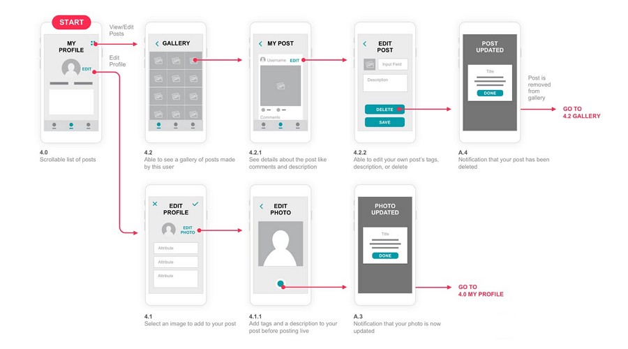

# Projeto de Interface

Visão geral da interação do usuário pelas telas do sistema e protótipo interativo das telas com as funcionalidades que fazem parte do sistema (wireframes).

 Apresente as principais interfaces da plataforma. Discuta como ela foi elaborada de forma a atender os requisitos funcionais, não funcionais e histórias de usuário abordados nas <a href="2-Especificação do Projeto.md"> Documentação de Especificação</a>.

## User Flow

Fluxo de usuário (User Flow) é uma técnica que permite ao desenvolvedor mapear todo fluxo de telas do site ou app. Essa técnica funciona para alinhar os caminhos e as possíveis ações que o usuário pode fazer junto com os membros de sua equipe.

> **Links Úteis**:
> - [User Flow: O Quê É e Como Fazer?](https://medium.com/7bits/fluxo-de-usu%C3%A1rio-user-flow-o-que-%C3%A9-como-fazer-79d965872534)
> - [User Flow vs Site Maps](http://designr.com.br/sitemap-e-user-flow-quais-as-diferencas-e-quando-usar-cada-um/)
> - [Top 25 User Flow Tools & Templates for Smooth](https://www.mockplus.com/blog/post/user-flow-tools)

## Wireframes

O objetivo do wireframe do nosso site é facilitar a navegação do usuário e planejar um sistema visualmente atrativo, focado em auxiliar no processo de adoção, contribuindo para aumentar as chances de sucesso.

https://www.figma.com/site/ZOO8VfcLVItzkpR0VXhpHL/Wireframes?node-id=0-1&t=xOOM0zqFEUE5d8xq-1

### Wireframes do site

**Pagina inicial**
Focamos em um layout simples que chamasse a atenção para os pontos principais (filtros, barra de busca e opção de ver mais pet's).
Assim o usuário teria facilidade de navergar e que aumentasse a probabilidade de adoção. Além de utilizar mensagens que apelem para emocional para engajar ainda mais os clientes.

**Menu e Aba de cadastro/entrar**
Parte em que os usuarios possam se cadastrar/entrar e que o site disponibilize esses dados, caso houver interesse em algum animal, para as ONG's e, assim, possa obter as informações necessárias para que parte do processo de doação seja agilizado (nome, contato,..).
Um breve resumo de topico do que vai conter no site e ,desse modo, facilitar a navegação do clinte pelo site. Esses topicos redicionaram os usuarios para parte que desejam o que ajuda no desenvolvimento do processo de adoção, ao focar no que realmente o clinte deseja.

**Pet's disponiveis**
Parte em que o usuario pode ter uma breve noção dos animais, podendo analisar qual animal gostaria de adotar. Os botões, imagens e a breve informação dos animais ajuda a aproximar mais o clinete do animal gerando maior identificação e, assim, facilitando o processo de adoção e engajamento com a causa. Além disso, tem uma parte clicavel que o cliente pode obter opções mais detalhada de um pet que o interessou. 

**Quiz**
Criamos essa aba para facilitar a escolha dos cliente e ajudar a gerar um lar para os animais conforme suas necessidades, assim auxiliando na escolha perfeita e a melhor adaptação do pet ao novo ambiente 
Lá teremos botões que incentivem a adoção, um questionario básico para direcionar qual a melhor opção de acordo com a limitações do usuario, além de uma breve descrição do animal e o motivo dele ser a melhor alternativa ao final do quiz junto ao resultado.

**Doações**
Essa parte seria para engajar a comunidade a contribuir com o funcionamento da ONG's. Então os usuarios podem doar qualquer valor, tem mensagens motivacionais para favorecer a participação na causa, botões chamativos que atraiam a atenção do cliente e o incentive ainda mais a contribuição, além de mensagem de outros doadores para gerar maior confiabilidade. Também temos a parte para aqueles que não coseguem ajudar financeiramente, mas podem ajudar compartilhando, adotando...
O objetivo principal dessa parte é gerar engajamento pela causa dos animais. 

**ONG's cadatradas/ cadastrar sua ONG**
Para gerar a participação das pessoas é importante que o público tenha confiança, por isso essa parte mostramos ONG's que são parceiras do site, quantos animais foram resgatados, volutarios, entre outros.
Os formulários para cadastro, primeiramente, deverão conter informações básicas das instituições para que possamos gerar maior confiabilidade. Então terão que ter os dados básicos como: Nome, contato, Cnpj, localização, site oficial, etc. Ao final, deixar uma parte com os documentos esseciais para finalizar o cadastro.
Posteriomente, será a parte das instituições cadastrarem os animais, seria bem parecido com a parte do cadastro das ONG's, sendo necessário: fotos do animais, informações sobre sua saúde, descrição breve sobre ele, etc.

**ONG's pareceiras**
Aqui teremos acesso a uma breve informação sobre as ONG's cadastradas e o contato delas para caso o usuario queira entrar em contato diretamente, tirar dúvidas a respeito do processo de adoção ou marcar uma visita ao local.
Então essa parte é importante ter uma botão chamativo para que o cliente consiga entrar em contato facilmente e dados esseciais, como: localização, telefone, entre outros.

**Meus anuncios**
É importante que as ONG's consigam apagar um anuncio quando um pet for adotado, alterar dados dele, ver quais ainda estão ativos, ver quantas pessoas visitaram esse pet. Então, pensando nisso, disponibilizariamos uma aba que pudesse ser de mudado de forma facil e rápida, além de ter todos as ferramentas para que a adoção seja realizada rapidamente e com maior probabilidade de sucesso.

**Duvidas e fechamneto do site**
Teremos botões e título chamativo para que a pessoa que está procurando um suporte encontre-o com facilidade e possa resolver suas dúvidas pendentes.
Ao final da página teremos um menu minimalista, onde o clinete pode voltar para alguma aba que estava procurando.

 
> **Links Úteis**:
> - [Protótipos vs Wireframes](https://www.nngroup.com/videos/prototypes-vs-wireframes-ux-projects/)
> - [Ferramentas de Wireframes](https://rockcontent.com/blog/wireframes/)
> - [MarvelApp](https://marvelapp.com/developers/documentation/tutorials/)
> - [Figma](https://www.figma.com/)
> - [Adobe XD](https://www.adobe.com/br/products/xd.html#scroll)
> - [Axure](https://www.axure.com/edu) (Licença Educacional)
> - [InvisionApp](https://www.invisionapp.com/) (Licença Educacional)
